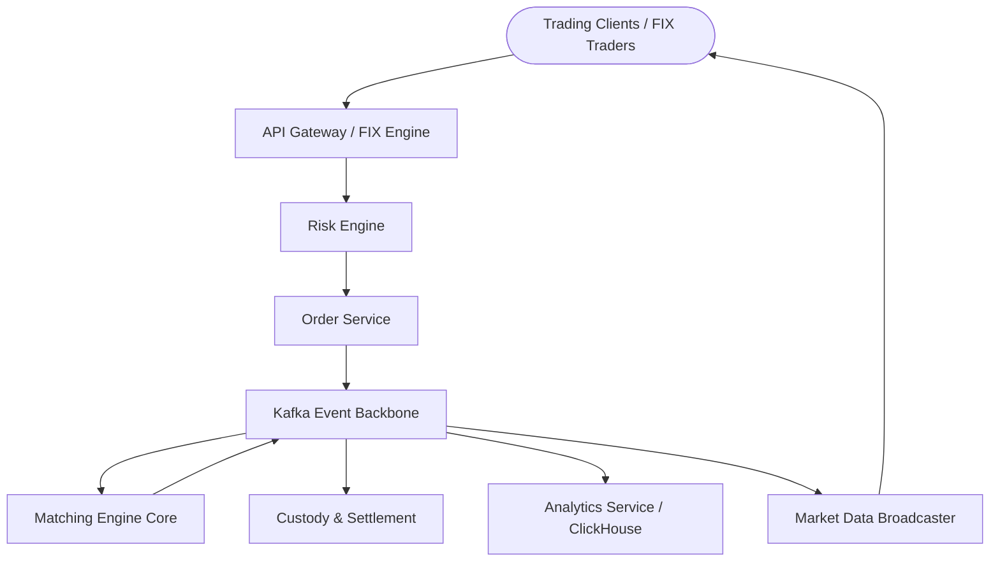

# Veridian Architecture Overview

## Executive Summary

Veridian (TradeCraft Pro) is an institutional-grade, event-driven distributed trading platform designed to process upwards of **100,000 trades/sec** with **sub-millisecond latency (P99 < 1ms)**. The system is partitioned into specialized microservices communicating asynchronously over low-latency message buses and shared off-heap structures, while adhering to strict ACID financial guarantees.

---

## Architectural Principles

1. **Single-Writer Principle in Matching Core**: Order books for any single asset are operated strictly by a single pinned execution thread to eliminate mutex contention and CPU cache invalidations.
2. **Lock-Free Concurrency**: Inter-thread communications utilize lock-free circular ring buffers (LMAX Disruptor pattern) with pre-allocated object pools, ensuring zero garbage collection overhead on the hot path.
3. **CQRS & Event Sourcing**: Commands (order placement, cancellation) append to an immutable transactional event stream, from which specialized read projections (Redis order books, ClickHouse analytics) are materialized.
4. **Pre-Trade Risk Gateways**: Every inbound order is subjected to sub-microsecond pre-trade risk evaluation before routing to matching cores.
5. **Polyglot Persistence**: Data storage is matched strictly to access patterns:
   - PostgreSQL: Relational transactional ledger & outbox tables.
   - Redis: In-memory live order book state & real-time risk profile caches.
   - ClickHouse: Columnar storage for tick-level analytics, slippage calculations, and VWAP.
   - Apache Kafka: Durable, partitioned event streaming backbone.

---

## Microservices Topology

---

## Latency Budgets & Target SLOs

| Step | Operation | Target Latency | P99 Latency |
|---|---|---|---|
| 1 | API Gateway TLS termination & Auth | 120 µs | 350 µs |
| 2 | Risk Engine Pre-Trade Validation | 40 µs | 120 µs |
| 3 | Order Persistence & Outbox Append | 300 µs | 800 µs |
| 4 | Matching Engine Disruptor RingBuffer | 8 µs | 25 µs |
| 5 | Order Book Match Execution | 15 µs | 60 µs |
| 6 | Market Data L2 Broadcast | 150 µs | 450 µs |
| **Total** | **Roundtrip Order-to-Ack** | **~633 µs** | **< 1.8 ms** |
