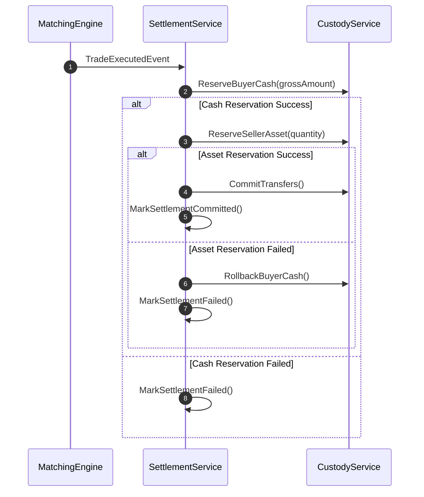

# Distributed Settlement & Saga Orchestration

## Overview

Unlike traditional financial markets with T+2 or T+1 settlement cycles, Veridian executes atomic clearing and settlement with simulated continuous gross settlement (T+0).

Because transactions cross multiple microservice boundaries (`matching-engine`, `custody-service`, and `settlement-service`), distributed transactions are coordinated via the **Saga Pattern**.

---

## Saga Workflow

---

## Compensating Transactions

Every step in the clearing saga defines an explicit compensating transaction:
- `ReserveBuyerCash` $\rightarrow$ `RollbackBuyerCash`
- `ReserveSellerAsset` $\rightarrow$ `RollbackSellerAsset`

In the event of network timeouts or system partition, uncommitted sagas are automatically audited and reconciled by background recovery workers.
